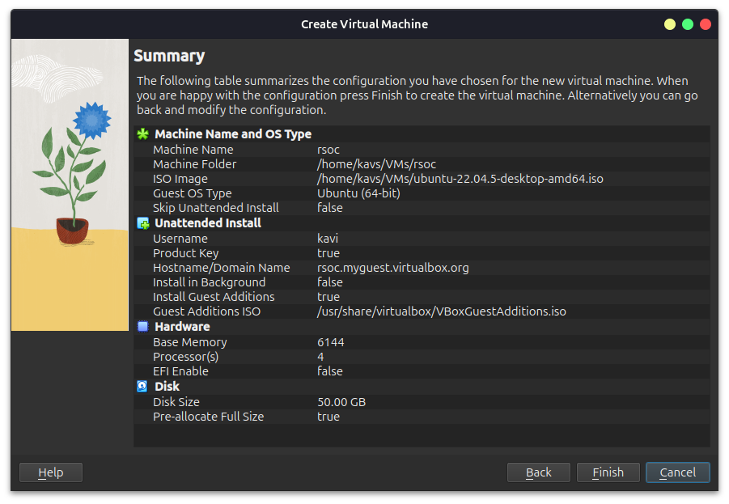
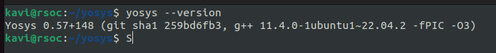
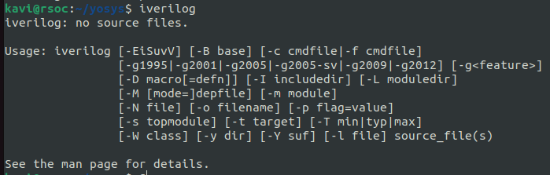
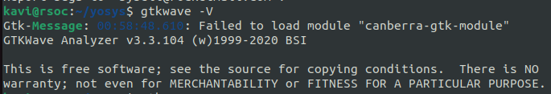
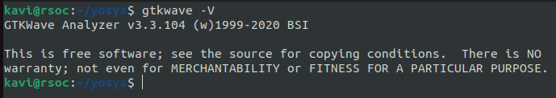

# RISC-V Reference SoC Tapeout Program VSD

## week 0 - system check and tool installation

### Prerequisites:
- install virtualbox
- setup vm with following spec:
    - 6GB RAM 
    - 50 GB HDD
    - Ubuntu 20.04+
    - 4vCPU

Config overview of vm:

### Tool installation
**Prerequisite:** 
- update the packages and apt repo: `sudo apt-get update`
- install git if not present: `sudo apt install git`
- install make if not present: `sudo apt install make`
#### Yosys
```bash
git clone https://github.com/YosysHQ/yosys.git && cd yosys

sudo apt-get install build-essential clang bison flex libreadline-dev gawk tcl-dev libffi-dev git graphviz xdot pkg-config python3 libboost-system-dev libboost-python-dev libboost-filesystem-dev zlib1g-dev

make config-gcc

git submodule update --init --recursive

make

sudo make install
```
Checking installtion correctness:


#### iverilog
```bash
sudo apt-get install iverilog 
```
Checking installtion correctness:


### gtkwave
```bash
sudo apt install gtkwave 
```
_Troubleshooting:_ 


if this warning occurs, run `sudo apt install libcanberra-gtk-module libcanberra-gtk3-module`

Checking installtion correctness:
